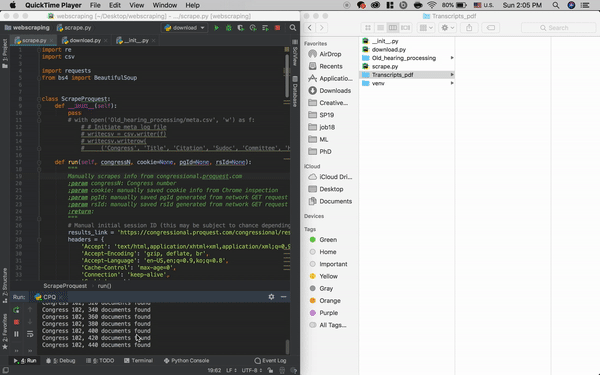

# Scrape-Proquest-Congressional
- Scrapes information (title, citation, sudoc, committee, hearing date, full pdf link) from 'https://congressional.proquest.com/' and saves the meta file.  
- Downloads the full pdf from the logged meta file.  
  

### Note
You must change the headers and query by logging into the website and inspecting the Network activity via Chrome DevTools (or similar). You should especially look at *cookies*, *accountid*, *groupid*, *pgId*, *rsId*.
